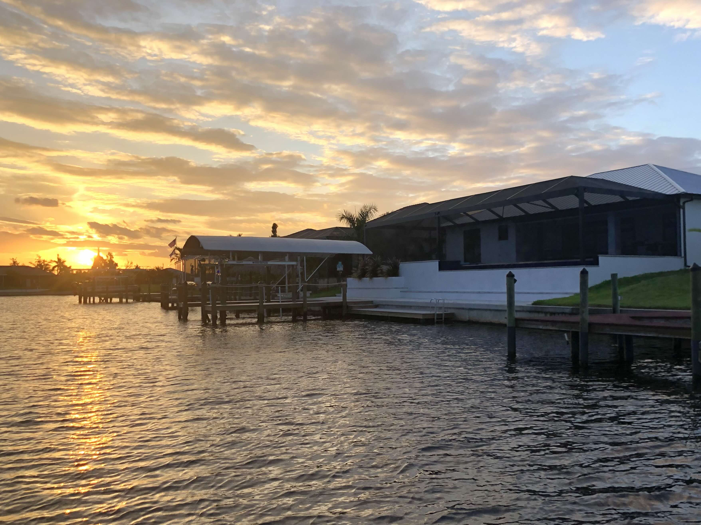
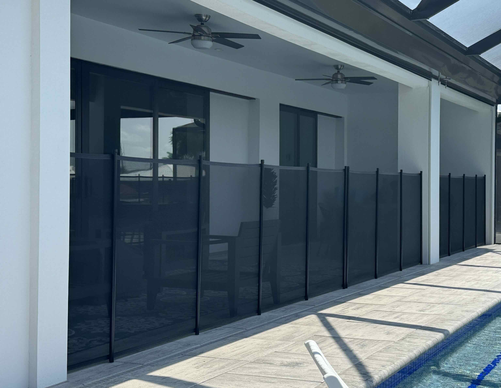
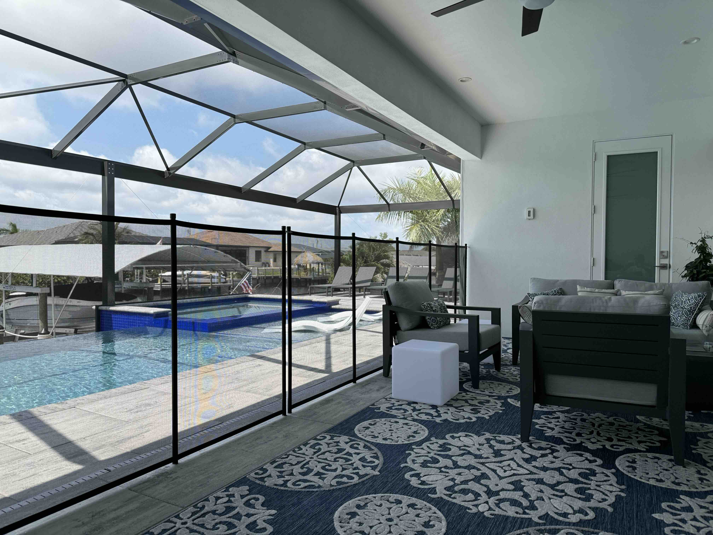

# PatricksVilla Cape Coral

## Die Villa

PatricksVilla in Cape Coral, Florida, wurde im Jahr 2024 fertiggestellt und bietet dem anspruchsvollen Urlauber weit mehr, als nur eine normale Ferienunterkunft.

Wir, die deutschen Besitzer, garantieren Ihnen überragenden Kundendienst. Wenn Sie sich fuer PatricksVilla entschieden haben, sprechen Sie von Anfang an mit uns. Wir verwalten und kümmern uns um unser Haus und unsere Gäste selbst und stehen Ihnen für Fragen und Anregungen 24 Stunden am Tag, 7 Tage die Woche zur Verfuegung.

Hier nur ein Paar der Highlights von PatricksVilla in Cape Coral.

- 3 Schlafzimmer, alle mit King-Size Betten ausgestattet und alle mit eigenem Badezimmer.
- Das Master-Schlafzimmer ist mit einer modernen Badewanne und einer Durchgeh-Dusche ausgestattet
- Zwei der drei Schlafzimmer haben direkten Zugang zur Terasse und dem Pool
- Schnelles WLAN/WiFi im ganzen Haus und auf der Terasse
- HD Fernseher und Apple TVs in allen Schlafzimmern
- 77 Zoll HD QLED Fernseher mit Soundbar für ein super Fernseherlebnis
- Apple TV Konsolen an allen Fernsehern mit ARD-, ZDF-, ORD-, SRF-Mediathek und Live-TV. Netflix, Apple TV Plus, HBO Max, Prime Video
- Eigener, grosser Infinity Pool mit toller Sicht über den Kanal, selbstverstaendlich beleuchtet und kann in den Wintermonaten auch geheizt werden.
- Ihr eigener Whirlpool.
- Gemütliche Sitzecke auf der Terrasse, mit Propangas-Feuertisch
- Terassen Esstisch fuer 8 Personen und sauberem Gasgrill
- 2 Wasserliegen im Pool und eine lange Sitzkante über die länge des Pools
- 2 Kajaks (1 Einzel und 1 Doppel-Kajak) um die tolle Mangrovenlandschaft und die aussergewöhnliche Tierwelt gleich um die Ecke zu erkunden.
- 3 Fahrräder, denn Cape Coral hat mehr als 144 km Fahrradwege.
- Ihr eigenes Bootdock. Mieten Sie sich Ihr Boot und legen Sie direkt vor Ihrem Haus an.
- Angeln vom Dock

Ein wichtiger Aspekt Ihres Urlaubs ist die Sauberkeit Ihres Ferienhauses. PatricksVilla wird von uns persönlich vor jedem Gast exzellent gereinigt.

Wir, die deutschen Besitzer kümmern und immer persönlich um unsere Gäste, Sie sprechen nie mit einer Vermietagentur.

### Warum Cape Coral?

Es gibt mehrere Gründe, warum eine Reise nach Cape Coral, Florida, lohnenswert ist:

1. Naturschönheit:

   Cape Coral ist bekannt für seine wunderschönen Wasserwege mit über 400 Meilen Kanälen. Es ist ein Paradies für Naturliebhaber und bietet atemberaubende Ausblicke sowie viele Outdoor-Aktivitäten wie Bootfahren, Angeln und Kajakfahren.

2. Golf:

   Wenn Sie ein Golf-Enthusiast sind, finden Sie in Cape Coral und der Umgebung ausgezeichnete Golfplätze. Das Wetter ist das ganze Jahr über perfekt zum Golfen.

3. Strände:

   Obwohl Cape Coral selbst keinen Strand hat, sind einige der besten Strände Floridas wie Sanibel Island und Fort Myers Beach nur eine kurze Autofahrt entfernt. Diese Strände bieten weißen Sand, klares Wasser und atemberaubende Sonnenuntergänge.

4. Tierwelt:

   Cape Coral beheimatet eine Vielzahl von Tieren, darunter Delfine, Seekühe und viele Vogelarten. Sie können die örtlichen Parks und Naturschutzgebiete erkunden, um diese Tiere in ihrer natürlichen Umgebung zu sehen.

5. Entspannung:

   Wenn Sie nach einer entspannenden Auszeit suchen, bietet Cape Coral eine entspannte Atmosphäre mit vielen Möglichkeiten zum Entspannen. Egal, ob Sie am Pool entspannen oder einen gemütlichen Spaziergang am Wasser machen, hier finden Sie viele Möglichkeiten, um zur Ruhe zu kommen.

6. Restaurants am Wasser:

   Cape Coral hat eine blühende kulinarische Szene mit vielen Restaurants, die am Wasser liegen. Sie können köstliche Meeresfrüchte genießen, während Sie die malerische Aussicht auf die Wasserwege genießen.

7. Sicherheit:

   Cape Coral ist eine der 16 sichersten Städte in den USA. 180 Städte wurden untersucht, unter anderem nach Kriminalität, Autounfällen und Arbeitslosigkeit.

8. Florida Wetter:

   Die Sonne scheint fast immer und es ist immer schön warm. Zwischen November und April liegen die Durchschnittstemperaturen bei etwa 24°C, die Sommermonate sind warm und feucht. Nachmittags gibt es oft einen heftigen Regenschauer, aber nach einer Stunde scheint auch wieder die Sonne.

Insgesamt bietet Cape Coral eine perfekte Mischung aus Naturschönheit, Outdoor-Aktivitäten und Entspannung und ist somit ein ideales Reiseziel für Reisende, die dem hektischen Alltag entfliehen möchten.

### Sicherheitsausstattung

Die Sicherheit unserer Gäste ist uns natürlich genauso wichtig, wie die Erholung und der Spaß, den Sie in PatricksVilla haben werden.

Auf Wunsch installieren wir Ihnen den Pool-Sicherheitszaun (Foto). Dieser wird zwischen Pool und den Terassentüren im Wohnzimmer und dem Elternschlafzimmer installiert und bewirkt, dass Kinder keinen uneingeschränkten Zugang zum Pool haben.

Die Terassentüren vom Schlafzimmer 2 werden nicht von dem Sicherheitszaun abgedeckt und sind daher mit zwei unabhängigen „Tür AUF/ZU Alarmen“ ausgestattet.

Sollten Sie Fragen haben, oder Hilfe benoetigen, wir stehen Ihnen selbstverständlich jederzeit gerne zur Verfügung.

Klicken Sie einfach auf das "MAIL Symbol", oder rufen Sie uns doch einfach an:

- in den USA +1 808 498 7477 - wir rufen Sie natürlich sofort zurück-
- FaceTime, WhatsApp +1 808 498 7477
- Familie in Deutschland +49 30 411 11 24

[Bitte klicken Sie hier um unser
"On-line Gästebuch" anzuschauen](http://users.smartgb.com/g/g.php?a=s&i=g18-42519-4b&m=all&p=1)

### Wir würden uns freuen, bald von Ihnen zu hören

[email](mailto:dirk@patricksvilla.com)

## Come in and find out
